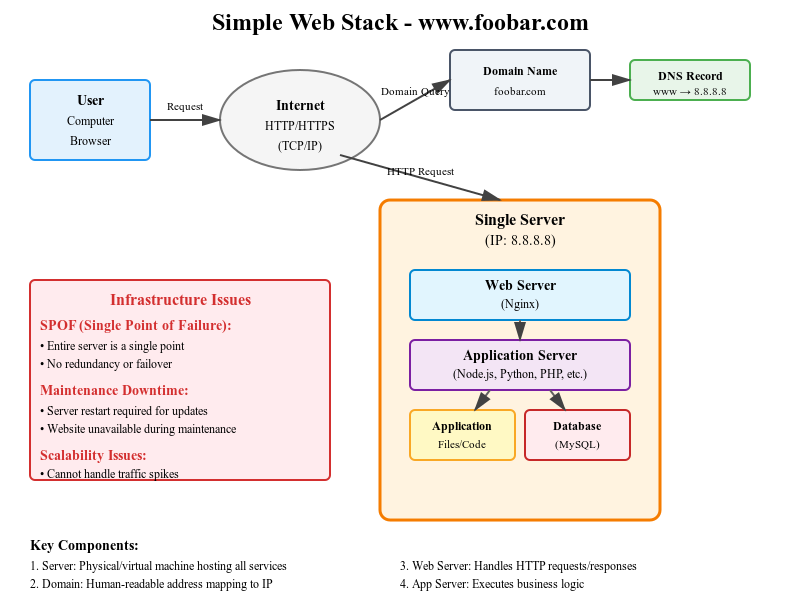

Task 0: Simple Web Stack - Whiteboard Exercise
This a comprehensive whiteboard diagram and explanation for a simple web stack infrastructure. 

Whiteboard Explanation - Simple Web Stack
User Access Flow:

User types www.foobar.com in their browser
DNS Resolution: Browser queries DNS to resolve www.foobar.com to IP address 8.8.8.8
HTTP Request: Browser sends HTTP/HTTPS request over the internet to server at 8.8.8.8
Web Server (Nginx): Receives the request and forwards it to the application server
Application Server: Processes the request, executes business logic
Database/Files Access: Application retrieves data from MySQL database and/or application files
Response Generation: Application generates HTML/JSON response
Response Delivery: Response travels back through web server → internet → user's browser

Component Definitions:
1. What is a server?

A physical or virtual computer that provides services to other computers
In this case, it hosts all the components needed to serve the website
Has its own IP address (8.8.8.8)

2. Role of the domain name (foobar.com)

Human-readable address that maps to the server's IP address
Easier to remember than numerical IP addresses
Provides a consistent access point even if server IP changes

3. DNS Record Type - www

"www" is a subdomain configured with an A record
A record (Address record) maps the hostname to IPv4 address
Points www.foobar.com → 8.8.8.8

4. Role of the web server (Nginx)

Handles incoming HTTP/HTTPS requests
Serves static content (images, CSS, JavaScript)
Acts as reverse proxy to application server
Manages SSL/TLS encryption
Load balancing (in more complex setups)

5. Role of the application server

Executes dynamic application logic
Processes business rules
Handles user sessions
Generates dynamic content
Communicates with database

6. Role of the database (MySQL)

Persistent data storage
Structured data management
Query processing
Data integrity and transactions
User data, content, configurations

7. Server-User Communication

Uses HTTP/HTTPS protocol
Built on top of TCP/IP
Port 80 for HTTP, Port 443 for HTTPS
Request-response model

Infrastructure Issues:
1. SPOF (Single Point of Failure)

Everything runs on one server
If server fails, entire website is down
No redundancy for any component
Single network connection

2. Maintenance Downtime

Deploying new code requires server restart
System updates need downtime
No way to perform maintenance without affecting users
Database maintenance affects entire system

3. Scalability Limitations

Cannot handle traffic spikes
Limited by single server resources (CPU, RAM, bandwidth)
No horizontal scaling capability
Database becomes bottleneck with increased load