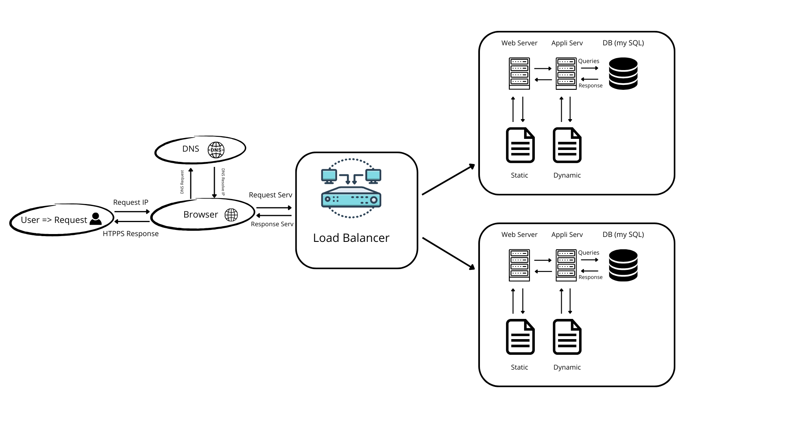

Task 1: Distributed Web Infrastructure - 
This is a comprehensive whiteboard diagram and explanation for a three-server web infrastructure. 

Task 1 Image Whiteboard Explanation - Distributed Web Infrastructure
Component Explanations:
1. Why Add a Load Balancer (HAproxy)?

Distributes incoming traffic between multiple servers
Prevents any single server from being overwhelmed
Provides automatic failover if one server fails
Improves response times and availability

2. Why Add a Second Server?

Eliminates single server as a point of failure
Allows handling more concurrent users
Enables maintenance without downtime
Provides redundancy for all components

3. Load Balancer Configuration:

Algorithm: Round Robin

Distributes requests equally between servers
Server 1 → Server 2 → Server 1 → Server 2...
Simple and effective for similar server capabilities

Setup Type: Active-Active

Both servers actively handle requests
Maximum resource utilization
Better performance than Active-Passive

4. Active-Active vs Active-Passive:

Active-Active:

All servers handle traffic simultaneously
Better resource utilization
Higher overall capacity
Load is distributed

Active-Passive:

One server active, others standby
Standby activates only on primary failure
Wastes resources but simpler
Good for stateful applications

5. Database Primary-Replica Cluster:

How it works:

Primary (Master) handles all writes
Changes are replicated to Replica (Slave)
Replica can handle read queries
Asynchronous or synchronous replication

Primary Node:

Handles all write operations
Source of truth for data
Replicates changes to replicas

Replica Node:

Read-only copy of primary
Can handle read queries (reduces primary load)
Provides backup for disaster recovery
Can be promoted to primary if needed

Infrastructure Issues:
1. Single Points of Failure (SPOF):

Load balancer itself (single instance)
No redundant network connections
Single internet connection

2. Security Issues:

No firewall protection

All ports potentially exposed
No traffic filtering

No HTTPS encryption

Data transmitted in plain text
Vulnerable to man-in-the-middle attacks

Database directly accessible

Should be on private network
No access control

3. No Monitoring:

No system performance tracking
No alert system for failures
No metrics collection
Can't proactively identify issues
No capacity planning data

Additional Considerations:
Application Files:

Each server has identical codebase
Must be synchronized during deployments
Consider shared storage or deployment automation

Load Distribution:

Round Robin gives 50/50 split
Could adjust based on server capacity
Consider session persistence requirements

Database Replication Lag:

Replica might be slightly behind primary
Consider read-after-write consistency needs
May need to route some reads to primary

This distributed architecture significantly improves upon the single-server design by adding redundancy and load distribution, though it still has several areas for improvement in terms of security, monitoring, and additional redundancy.