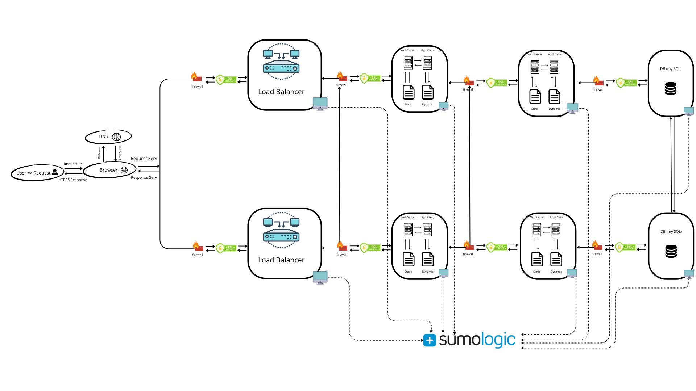

In a typical web infrastructure, **web servers** and **application servers** serve distinct roles:
- **Web Server**: Handles HTTP requests, serves static content (HTML, CSS, JS), and forwards dynamic requests to the application server. Examples include **Nginx** and **Apache**.
- **Application Server**: Executes business logic, processes dynamic content, and interacts with the database. Examples include **Node.js**, **Tomcat**, and **Django**.

---

### **Infrastructure Requirements**
To build a scalable and fault-tolerant infrastructure, the following components are required:

1. **1 Server**:
   - Acts as the **web server** to handle incoming HTTP/HTTPS requests.
   - Serves static files and forwards dynamic requests to the application server.

2. **1 Load Balancer (HAproxy)**:
   - Distributes incoming traffic across multiple servers to ensure high availability and scalability.
   - Configured as a **cluster** with another load balancer for redundancy.

3. **Split Components**:
   - **Web Server**: Dedicated server for handling HTTP/HTTPS requests and serving static content.
   - **Application Server**: Dedicated server for processing business logic and generating dynamic content.
   - **Database**: Dedicated server for storing and managing data.

---

### **Explanation of Additional Elements**

1. **Why add a load balancer (HAproxy)?**  
   - **Purpose**: To distribute traffic evenly across multiple servers, preventing any single server from being overwhelmed.  
   - **Benefits**: Improves **availability**, **scalability**, and **fault tolerance**.  
   - **Cluster Configuration**: By configuring HAproxy as a cluster, you ensure redundancy. If one load balancer fails, the other can take over.  

2. **Why split components (web server, application server, database)?**  
   - **Web Server**: Dedicated to handling HTTP/HTTPS requests and serving static content. This separation ensures efficient resource utilization.  
   - **Application Server**: Dedicated to processing business logic and generating dynamic content. This separation improves performance and scalability.  
   - **Database**: Dedicated to storing and managing data. This separation ensures data integrity and security.
